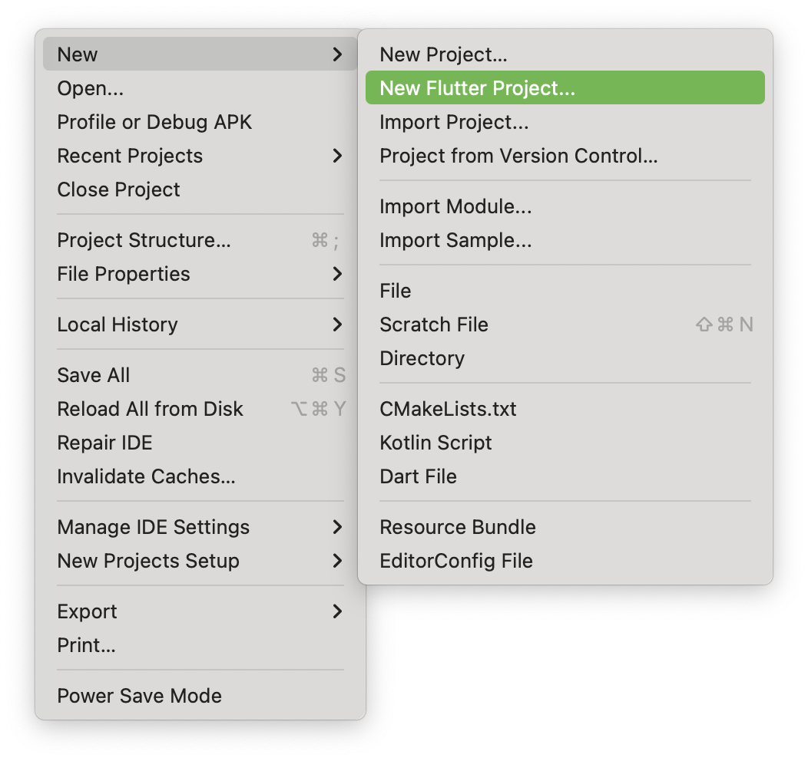
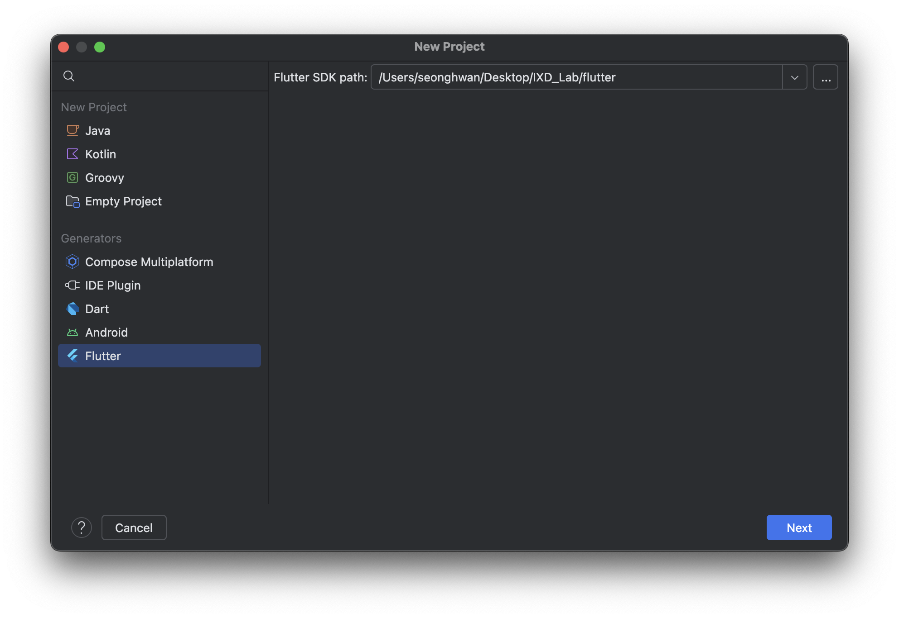
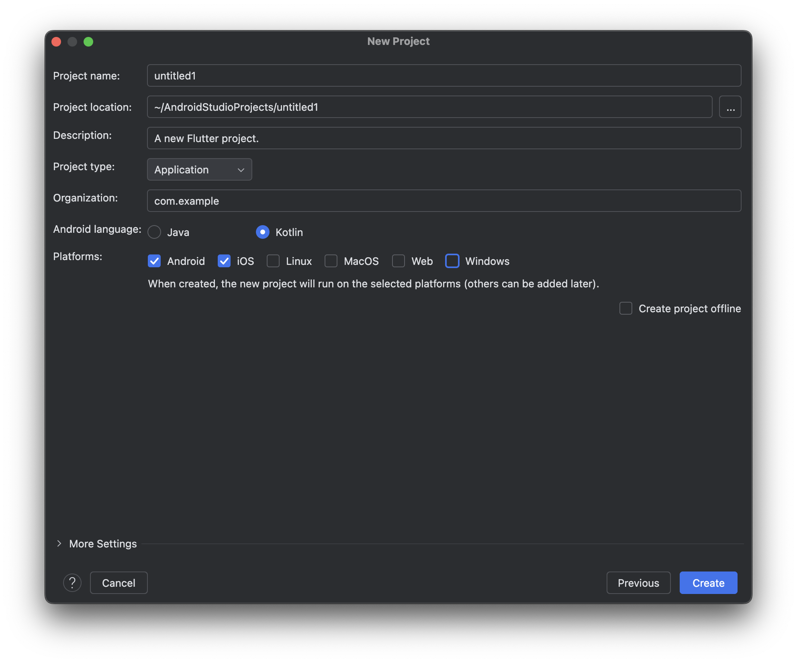
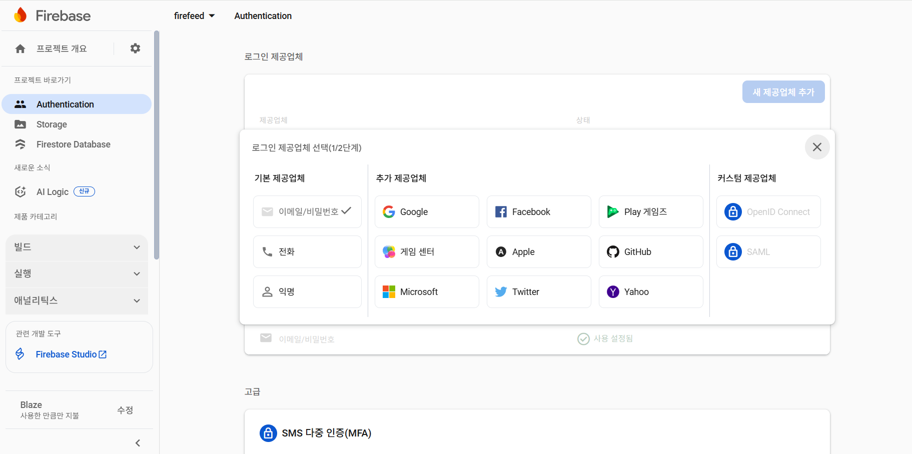
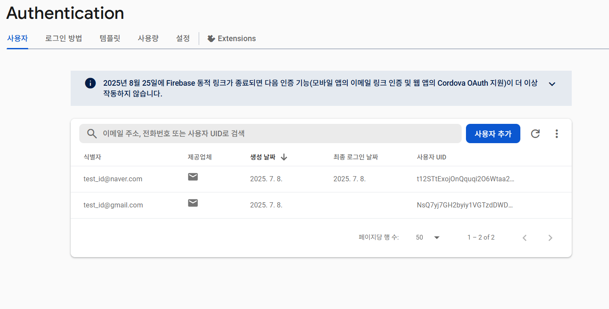

# 🔥 Flutter CLI를 이용한 Firebase 연동 튜토리얼

FlutterFire CLI를 사용하면 Flutter 프로젝트에서 Firebase 설정을 각 플랫폼(Android, iOS, Web)에 맞게 자동으로 구성할 수 있음  
이 튜토리얼에서는 Firebase CLI와 FlutterFire CLI를 사용하여 Flutter 프로젝트에 Firebase를 연동하는 전체 과정을 안내함

---


# ✅ 사전 준비 (Prerequisites)

Firebase 연동을 시작하기 전, 다음 항목이 준비되어 있어야 함:

## 🚀 IOS
Windows에서는 iOS 앱을 실행하거나 빌드할 수 없음.
오직 macOS에서만 Xcode와 함께 iOS Flutter 앱을 완성할 수 있음.
따라서 iOS용 Firebase 연동을 실험하려면 mac이 필요함.


## 🛠 Android Studio 설치 및 SDK 설정

- Android Studio 설치
- Plugins에서 Flutter, Dart 검색 후 설치
- 필수 컴포넌트 설치

  - Android SDK Platform (API 35 이상)
  - Android SDK Command-line Tools (latest)
  - Android SDK Build-Tools
  - Android SDK Platform-Tools
  - Android Emulator

- 설치 확인 및 Emulator 실행함

---

## 🐛 flutter doctor 오류 해결

```bash
flutter doctor
```

오류 예:

`[✗] Android toolchain - develop for Android devices`
`✗ Unable to locate Android SDK.`
- 원인: Android SDK의 경로를 찾지 못함.
- 해결:`flutter config --android-sdk "C:\Users\...\AppData\Local\Android\Sdk"`(경로는 본인이 설치한 SDK의 위치)를 실행하여 경로 설정

`✗ Android license status unknown.`
- 원인: Android license 등록을 하지 않음.
- 해결: `flutter doctor --android-licenses`를 실행하여 라이센스 등록

## 🐬 Flutter Project 생성
- File -> New -> New Flutter Project

- 왼쪽 Generators에 Flutter 선택 후 Flutter SDK 경로 설정 확인 후 Next

- Project name 입력 후 Platforms에서 Android, Web, 필요한 경우 iOS 선택 후 Create
(Web은 test할 때 사용하기 위함이다. iOS는 MacOS에서만 개발 가능하며 xCode, cocoapods 추가 설치가 필요하다.)


---

## 🚀 Getting Started

Firebase 프로젝트가 이미 생성되어 있어야 하며, 프로젝트 ID는 아래 명령어에서 사용됨
## 🕹️ Step 0: Firebase 초기 설정
1. [Firebase 홈페이지](https://firebase.google.com/?hl=ko)로 이동
2. 오른쪽 상단에 'Go to console' 클릭
3. 프로젝트 'Firebase 프로젝트 만들기' 클릭
4. 프로젝트 이름 입력
5. Gemini 사용 설정 선택 후 계속
6. Google 애널리틱스 사용 설정 선택 후 계속 (배포 시 애널리틱스를 이용해 무료 분석이 가능해 권장)
7. Firebase를 관리할 구글 계정 선택 후 프로젝트 생성 클릭 -> 프로젝트 생성 완료


"앱에 Firebase를 추가하여 시작하기" 밑 Flutter(제일 오른쪽) 선택한 후에 1~3단계를 따라하면 된다. (밑에 자세히 설명)
---

## ⚙️ Step 1: FlutterFire CLI 설치 및 실행

### 1. FlutterFire CLI 전역 설치

- **Firebase CLI 설치 및 로그인**

```bash
npm install -g firebase-tools
firebase login
```

- **Flutter SDK 설치**

[공식 페이지](https://docs.flutter.dev/get-started/install)에서 개발 환경 선택
-> 개발할 App Type 선택 -> (Android) 'Install the Flutter SDK'에서 Download and install 탭 선택
-> `flutter_windows_3.32.5-stable.zip` 다운로드 후 압축 해제  
예: `C:\Android\flutter` 경로에 저장함 (User 폴더명이 한글인 경우 SDK 실행 시 오류가 발생하므로 경로에 한글이 없어야 함)

- **환경 변수 설정**

시스템 환경 변수 `Path`에 다음 경로 추가함:

```text
C:\Android\flutter\bin
```

- **Flutter SDK 설치 확인**

```bash
flutter --version
```

- **Flutter 프로젝트 생성 (또는 기존 프로젝트 사용)**

```bash
flutter create my_app
cd my_app
```

### 2. Firebase 프로젝트와 연동

```bash
dart pub global activate flutterfire_cli
```
- flutter fire CLI 설치 후 pub/cache/bin 환경 변수 추가
- 그런 다음 Flutter 프로젝트 디렉터리의 루트에서 다음 명령어를 실행
```
flutterfire configure --project=YOUR_PROJECT
```

> 위 명령을 실행하면 다음 작업이 자동으로 수행됨:
>
> - Android, iOS, Web 앱이 Firebase 프로젝트에 등록됨  
> - `lib/firebase_options.dart` 파일이 생성됨

---

## 🔧 Step 2: Firebase 초기화

- Android Studio에서 Project를 Open한 후 터미널에서 `pub add firebase_core` 실행
- `pubspec.yaml` 파일에 dependencies에 firebase_core 추가됌.

```yaml
dependencies:
  flutter:
    sdk: flutter
  firebase_core: ^2.30.0 // 최신 버전으로 자동 설정
```

---

### main.dart

- 초기 main.dart에서 아래 코드처럼 import와 main 함수 수정
```dart
import 'package:flutter/material.dart';
import 'package:firebase_core/firebase_core.dart';
import 'firebase_options.dart';

void main() async {
  WidgetsFlutterBinding.ensureInitialized();
  await Firebase.initializeApp(
    options: DefaultFirebaseOptions.currentPlatform,
  );
  runApp(const MyApp());
}
```

---

## ➕ Step 3: Firebase Authentication & Firestore 연동

### 필요한 빌드 추가
- `pub add firebase_auth` : Firebase Authentication 빌드 사용
- `pub add cloud_firestore` : Firestore Database 빌드 사용

```yaml
dependencies:
  firebase_auth: ^4.17.5
  cloud_firestore: ^4.15.5
```

### Firebase Authentication

- 로그인 방법을 설정할 수 있다. (이메일/비밀번호, 전화번호, 소셜 로그인 등)

- `createUserWithEmailAndPassword()` : 이메일과 비밀번호로 새로운 사용자 계정을 생성, 함수를 실행하면 상단 화면에 자동으로 추가된다.
코드 (e.code)	설명
email-already-in-use	이미 다른 계정에서 사용 중인 이메일 주소
invalid-email	이메일 형식이 잘못됨 (예: user@ 같은 형식 오류)
operation-not-allowed	이메일/비밀번호 가입이 Firebase 프로젝트에서 비활성화되어 있음
weak-password	비밀번호가 너무 약함 (보통 6자 미만)

- `signInWithEmailAndPassword()` : 이메일과 비밀번호로 기존 사용자 로그인을 수행
코드 (e.code)	설명
user-not-found	해당 이메일로 가입된 계정이 없음
wrong-password	비밀번호가 일치하지 않음
invalid-email	이메일 형식 오류
user-disabled	해당 계정이 비활성화됨 (관리자에 의해 차단 등)

---

## 🧪 앱 실행 및 테스트

```bash
flutter run
```

---

## 🌐 Flutter Web 테스트

```bash
flutter run -d chrome
```

> 필요 시:

```bash
flutter config --enable-web
```

---

## ⚠️ 주의사항

- `firebase_options.dart`가 반드시 존재해야 Firebase 초기화가 성공함
- ```flutterfire configure --project=YOUR_PROJECT``` 시 자동으로 google-services.json 파일 생성
- Android의 경우 `google-services.json`, iOS의 경우 `GoogleService-Info.plist`
- `flutterfire configure`를 다시 실행하면 기존 설정이 덮어씌워질 수 있음

---

## 📁 디렉토리 예시 구조

```bash
my_app/
├── lib/
│   ├── main.dart
│   ├── firebase_options.dart
│   └── auth_service.dart
├── pubspec.yaml
└── ...
```

---

## 📚 참고자료

- [FlutterFire 공식 문서](https://firebase.flutter.dev)
- [Firebase Authentication 문서](https://firebase.google.com/docs/auth)
- [Cloud Firestore 문서](https://firebase.google.com/docs/firestore)
